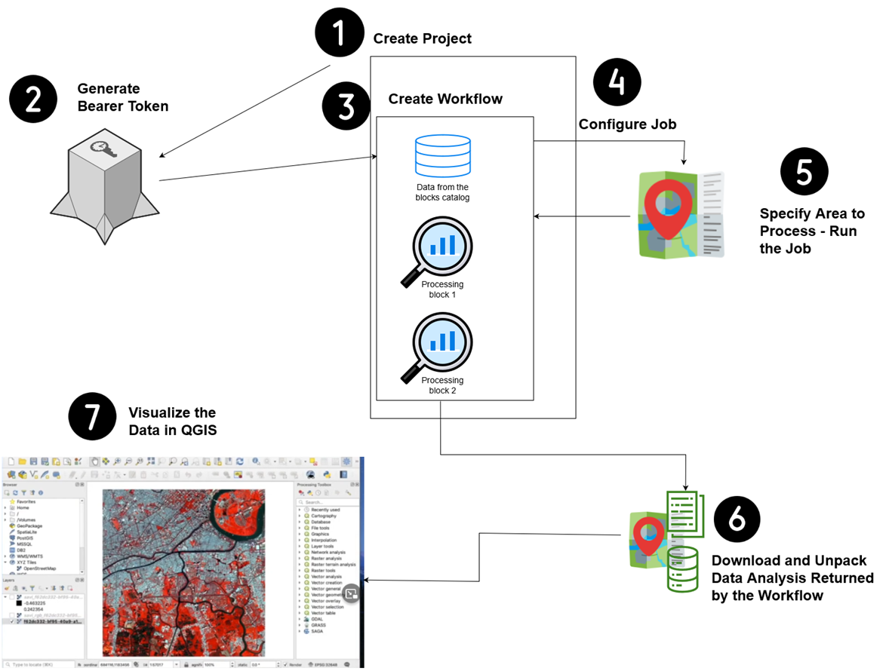

# Overview
The following graphic gives you a sequence and overview of the steps involved in processing an image using the UP42 APIs and then using QGIS to visualize the data returned by the UP42 APIs.

# Steps  

[1. Create a project in the UP42 Console UI](Steps/Create-a-project-in-the-UP42-Console-UI.md)  
[2. Use the project ID and Project API key to generate a bearer token](Steps/Generate-a-bearer-token.md)  
[3. Create a workflow that includes the data and one or more processing blocks](Steps/Create-a-workflow-that-includes-the-data-and-one-or-more-processing-blocks.md)  
[4. Configure the job/process](Steps/Configure-the-job.md)   
[5. Download and unpack the data analysis returned by UP42 for the selected area as per the workflow](Steps/Download-the-Output.md)  
[6. Visualize the data in QGIS](Steps/Download-QGIS-and-Visualize-the-Downloaded-Data.md)  
