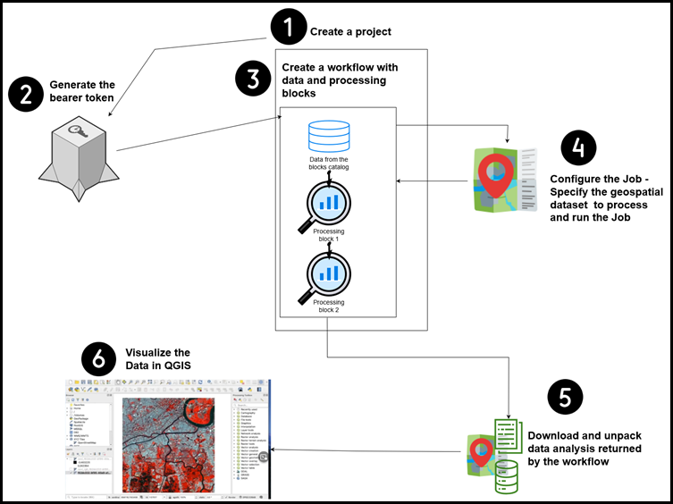

# Overview
Below is an overview of the process for processing an image using the UP42 APIs and then using QGIS to visualize the data returned by the UP42 APIs.

# Steps
1. Create a project in the UP42 [Console UI](../Steps/1. Create-a-project-in-the-UP42-Console-UI.md)
2. Use the project ID and Project API key to generate a bearer token 
3. Create a workflow that includes the data and one or more processing blocks
4. Configure the job/process 
5. Specify the area to be processed and Run the job. 
6. Download and unpack the data analysis returned by UP42 for the selected area as per the workflow
7. [Visualize the data in QGIS]()
