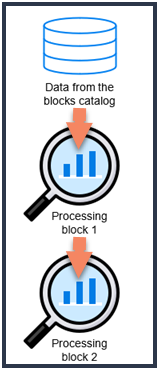

# 3. Create a workflow
A workflow is a Directed Acyclic Graph (DAG) of data and processing blocks. The workflow defines the order in which each operation associated with a certain block is performed.
A workflow includes the following: 

- **The first block in the workflow, a data block**: The first block is always a data block. A data block is an operator for a geospatial data source, such as a satellite or aerial images. 
- **One or more processing blocks**: A processing block is an operator for processing the previous data source or processing block output. 



<b>Image - A workflow with a data block and two processing blocks </b>


## Request Parameters


|   |   |
|---|---|
 Request  Type | POST | 
 URL | https://api.up42.com/projects/{projectID}/workflows| | 
 Authorization | [Bearer token](https://geospatialapis.stoplight.io/docs/processing-satellite-imagery-using-up42-apis/scgg70a0ykpet-2-generate-a-bearer-token-and-copy-its-value) | 

## Request Body


|   |   |
|---|---|
 id | null | 
 name |Name of the workflow | 
 description | Description of the workflow | 
 projectId |  Id of the project in which you want to create a workflow|
 tasks  | []|

 ## Sample Request
 ```json
 {
  "id": null,
  "name": "My brand new workflow with Pléiades and Pansharpening.",
  "description": "This workflow is used to generate pan-sharpened images.",
  "projectId": "cb5037d5-8bff-44ad-a2e6-a81a501df5ee", # You can find this on Console > Projects > [Project Name] > Developers
  "tasks": []
}
```

## Sample Response
 ```json
{
    "data": {
        "id": "fe98921f-0e84-48e3-939a-f5af0e815847",
        "name": "My brand new workflow with Pléiades and Pansharpening.",
        "description": "This workflow is used to generate pan-sharpened images.",
        "createdAt": "2022-05-29T10:41:16.996874Z",
        "updatedAt": "2022-05-29T10:41:16.996874Z",
        "createdBy": {
            "id": "cb5037d5-8bff-44ad-a2e6-a81a501df5ee",
            "type": "API_KEY"
        },
        "updatedBy": {
            "id": "cb5037d5-8bff-44ad-a2e6-a81a501df5ee",
            "type": "API_KEY"
        },
        "totalProcessingTime": 0
    },
    "error": null
}

 ```
 ## 3.1 Create Workflow Tasks/Blocks

### Request Parameters
|   |   |
|---|---|
 Request  Type | POST | 
 URL | https://api.up42.com/projects/{project_id}/workflows/{workflow_id}/tasks| | 
 Authorization | [Bearer token](https://geospatialapis.stoplight.io/docs/processing-satellite-imagery-using-up42-apis/scgg70a0ykpet-2-generate-a-bearer-token-and-copy-its-value) | 
 Body | Raw, JSON|

 ### Request Body Parameters

|   |   |
|---|---|
name | Name of the block to be created.|
parentName | Name of the parent block. Keep this null for the first block. In subsequent blocks, specify the name of the earlier block. |
blockID | Id for the block `[QuestionToSME: Where to find this? How can the user possibly know this before creating the task?]`

### Sample Request Body
 ```json
 [
  {
    "name": "Block Number 1",
    "parentName": null, # no parent block for the first block
    "blockId": "30bea695-32c4-41a6-bf42-ea7cde644eb0" #Id of a data block that meets the specs. More SPOT 6/7 datasets available at: https://docs.up42.com/tasking/datasets/spot
  },
  {
    "name": "Block Number 2",
    "parentName": "Block Number 1",
    "blockId": "903f0435-d638-475e-bbe9-53b5664a22a8"
  }
]

  ```
**Important:** While choosing a geospatial dataset, search and select one with the following specifications:

Image Parameter | Value | 
---------|----------
 Spatial resolution | 1.5m (pixel size) | 
 Image type | Optical (true color)/RGB |
 Sensor |SPOT 6/7 |

You can use the Id `30bea695-32c4-41a6-bf42-ea7cde644eb0` of the Tristereo Analytic data set.	More SPOT 6/7 datasets are listed at: [SPOT 6/7](https://docs.up42.com/tasking/datasets/spot). For more information on locating such a dataset, See [Search in the catalog](https://docs.up42.com/developers/api#operation/CatalogSearch). `[QuestionToSME: I could not get this ID to work. When I tried to query this data set ID, I got the response "Block not found with id 30bea695-32c4-41a6-bf42-ea7cde644eb0". But this ID is listed on the site.]`
### Sample response
[See json file](https://github.com/TheContentGym/GeospatialAPIs-UP42/blob/main/Steps/Examples/Create_Workflow_Task_response.json)

**Next step:** [4. Configure the job/process](Configure-the-job.md)
***
## Back To:  
  
    - [Overview](https://github.com/TheContentGym/GeospatialAPIs-UP42/blob/main/Overview.md)  
    - [Readme](https://github.com/TheContentGym/GeospatialAPIs-UP42/blob/main/README.md) 
***