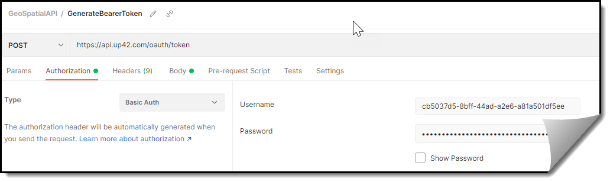
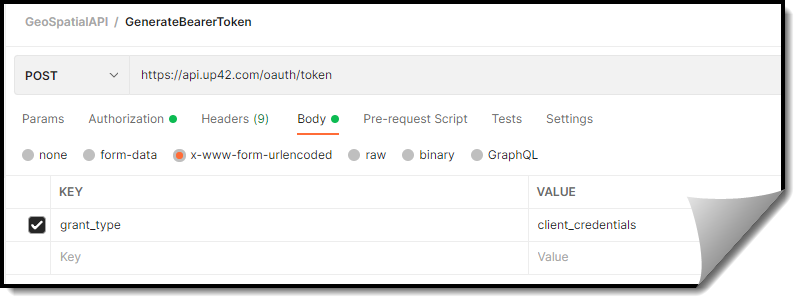

# 2. Generate a bearer token and copy its value

Use the following from the relevant project to generate a bearer token ([more information:](https://docs.up42.com/developers/authentication)):
- Project ID
- Project API Key  



|   |   |
|---|---|
 Request type       |       POST                         |
  URL               | https://api.up42.com/oauth/token   |
 Authorization      | BasicAuth                          |
 Username           | Project ID value                   |
 Password           | Project API Key value              |
 Body               | x-www-form-urlencoded              |

                    
You can find the values for Project ID and Project API Key in the [Console](https://console.up42.com/) > Projects > [Project Name] > Developers. 

## Request Body


`grant_type:client_credentials`



## Response Body

```json
{
    "data": {
        "accessToken": "eyJ0eXAiOiZ_4cSfvdFLV...88rd61GGB5gcifE8Ko96LqM" # Shortened value
    },
        "accessToken": "eyJ0eXAiOiZ_4cSfvdFLV...88rd61GGB5gcifE8Ko96LqM", # Shortened value
    "token_type": "bearer"
}
```
Copy the value of `accessToken` to make requests. You can use the `accessToken` value to make API requests on the UP42 server. For example, authorization using the bearer token to display available collections of images appears as follows in Postman: 


**Important:** The bearer token is valid for 5 minutes. After 5 minutes, use this process again to generate the bearer token and make further requests.  

**Next step:** [3. Create a workflow that includes the data and one or more processing blocks](Create-a-workflow-that-includes-the-data-and-one-or-more-processing-blocks.md)

***
Back To:  

-[Overview](https://github.com/TheContentGym/GeospatialAPIs-UP42/blob/main/Overview.md)  
-[Readme](https://github.com/TheContentGym/GeospatialAPIs-UP42/blob/main/README.md) 
***